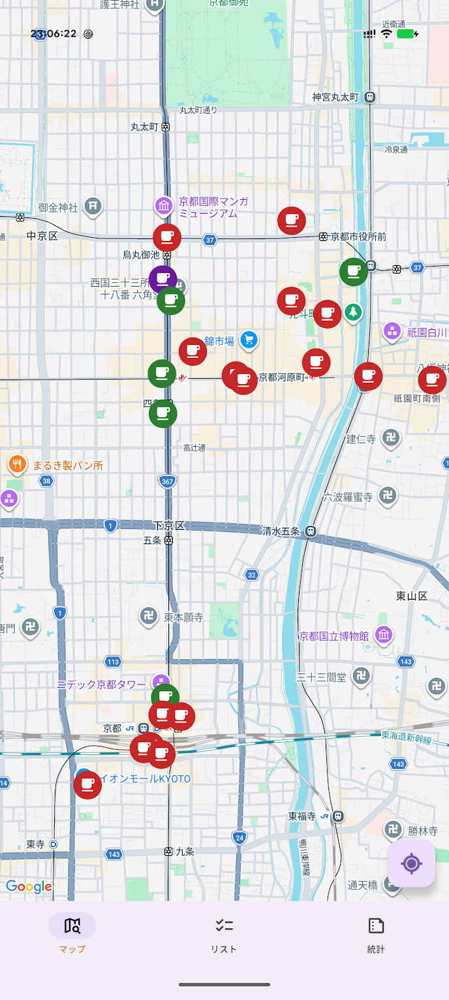
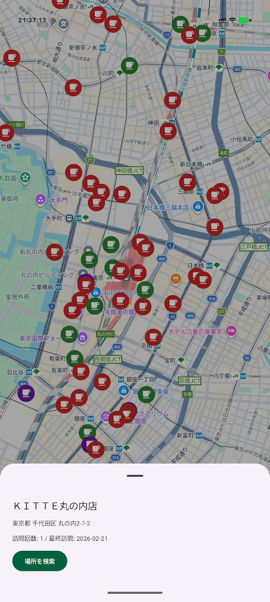
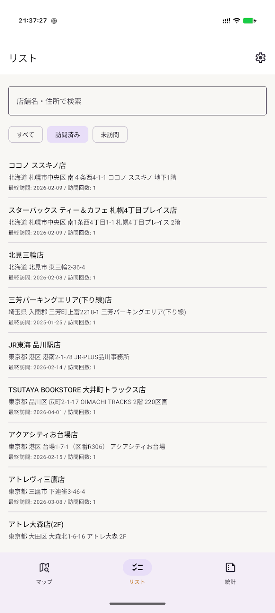
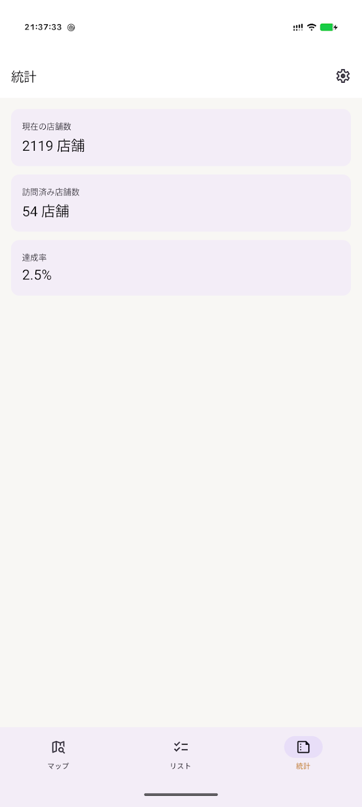
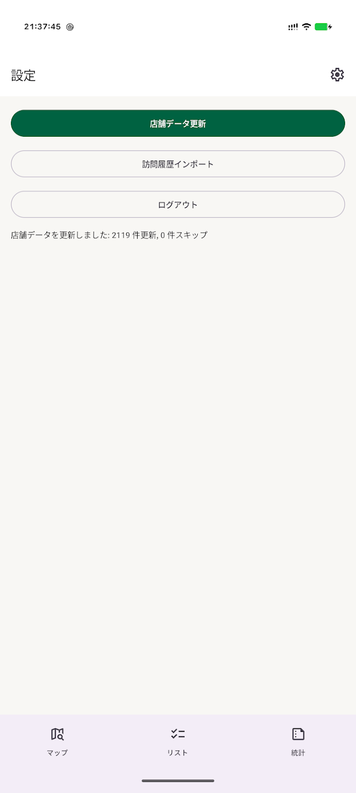

# OneMoreCoffee

国内のスターバックス店舗の訪問状況を管理する、私的利用を目的とした Android アプリです。

> [!WARNING]
> このアプリは**非公式**であり、スターバックス コーヒー ジャパン 株式会社とは一切関係ありません。
> 利用によって生じたいかなる損害・不利益について、責任を負いません。**自己責任のもとでご利用ください。**

## Screenshots

| マップ | 店舗詳細 | リスト | 統計 | 設定 |
|:---:|:---:|:---:|:---:|:---:|
|  |  |  |  |  |

## Features

- **マップ** — 全国のスターバックス店舗をマップ上にピン表示。訪問済み・未訪問を色で区別し、密集エリアはクラスタリング表示
- **店舗詳細** — ピンをタップすると店舗名・住所・最終訪問日を確認でき、そのままナビアプリで経路検索が可能
- **リスト** — 店舗名・住所でのキーワード検索と「すべて / 訪問済み / 未訪問」フィルタで絞り込み
- **統計** — 総店舗数・訪問済み店舗数・達成率をひと目で確認
- **訪問履歴インポート** — My Starbucks の「マイストアパスポート」から訪問履歴を自動インポート
- **店舗データ更新** — 最新の店舗マスタを取得して常に正確な情報を維持

## Get Started

### Google Maps API キー

地図画面を利用するには、リポジトリルートに `secrets.properties` を作成し、Maps SDK for Android の [API キー](https://console.cloud.google.com/google/maps-apis/credentials)を設定します。

```properties
MAPS_API_KEY=your_api_key
```
